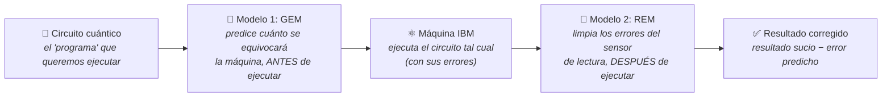

# Guía de lectura para el tutor

> Documento de entrada al proyecto, escrito sin tecnicismos. En 10–15 minutos de
> lectura da el contexto completo: qué problema ataca el TFM, qué hay construido,
> qué evidencias lo respaldan, y en qué puntos necesito criterio externo.

---

## 1. El problema, en dos minutos

Los ordenadores cuánticos actuales son como **una calculadora que funciona, pero
que se equivoca un poco en cada operación**. Cuantas más operaciones seguidas
encadenas, más error se acumula, y el resultado final sale "sucio".

La solución definitiva (la *corrección* de errores) existe en teoría, pero exige
máquinas miles de veces más grandes que las actuales — quedan décadas. Por eso la
pregunta práctica que investiga este TFM es otra:

> **Con las máquinas imperfectas que ya existen, ¿podemos *limpiar* el error en
> lugar de eliminarlo?**

Ahí entra el machine learning. Casi todos los trabajos publicados lo hacen
**después** de ejecutar: lanzan el cálculo, miran el resultado sucio, y una red
neuronal aprende a corregirlo — como revelar una foto movida e intentar enfocarla
a posteriori.

**La propuesta de este TFM añade algo que casi nadie ha explorado: predecir el
error *antes* de ejecutar.** La máquina de IBM publica cada día su "parte médico"
(qué componentes están más degradados). Mi primer modelo lee ese parte médico
junto con el diseño del cálculo y predice cuánto se va a equivocar la máquina
**sin gastar ni un segundo de máquina real**. Un segundo modelo corrige, ya tras
la ejecución, el error del "sensor" que lee el resultado final.

La utilidad práctica: si tienes 100 cálculos candidatos y presupuesto para lanzar
solo 20, puedes saber de antemano cuáles saldrán mejor — imposible con los
métodos que corrigen a posteriori.

## 2. El pipeline, de un vistazo

Los dos modelos se entrenan por separado con datos simulados (un "gemelo digital"
de la máquina de IBM que genero en mi portátil), y solo se combinan al final. Para
demostrar que el modelo aprende la *física* del error y no se limita a memorizar
ejemplos, lo evalúo con tipos de circuito que **jamás vio durante el
entrenamiento** (evaluación "zero-shot").

## 3. Qué hay construido y qué lo respalda

| Bloque | Estado | Evidencia |
|---|---|---|
| Revisión de la literatura (14 papers analizados frente a mis decisiones) | ✅ Hecho | `doc/SOTA/comparative_analysis.md` |
| Generador de datos sintéticos (el "gemelo digital" de la máquina IBM) | ✅ Hecho | `src/quantum_gen.py` + 37/37 tests automáticos pasando |
| Migración forzosa de hardware (IBM retiró la máquina de referencia original) | ✅ Hecho y documentado | `doc/migracion_heron.md` |
| Dataset preliminar (~180 muestras) para validar el pipeline | ✅ Hecho | `data/` (versionado con DVC) + análisis visual en `notebooks/01_eda_ibm_telemetry.ipynb` |
| Los dos modelos de deep learning (GEM y REM) | ⏳ Siguiente paso | Diseño cerrado en la documentación; código pendiente |
| Dataset completo (5.000 muestras) | ⏳ Pendiente | Espera decisión de parámetros + acceso IBM |
| Validación en máquina cuántica real | 🔒 Bloqueado temporalmente | La cuenta IBM está en verificación manual (trámite administrativo, no técnico) |

## 4. Mapa de lectura recomendado

Si dispones de **15 minutos**:
1. Esta guía (ya estás en ella)
2. `notebooks/01_eda_ibm_telemetry.ipynb` — el análisis visual de los datos: se ve el "parte médico" de la máquina, cómo se degrada con el tiempo, y qué pinta tienen los datos de entrenamiento

Si dispones de **una hora**:

3. `IDEA_GENERAL_TFM.md` — la explicación conceptual completa (por qué es distinto al estado del arte, qué se mide, qué limitaciones tiene)
4. `ROADMAP.md` — el estado detallado de cada tarea, con lo hecho y lo pendiente
5. `doc/SOTA/comparative_analysis.md` — cada decisión de diseño contrastada con los 12 papers de referencia

## 5. Sobre los datos (no están en GitHub)

La carpeta `data/` (calibración + 178 muestras, ~32 MB) no viaja en el repositorio.
Dos formas de obtenerla:

1. **Regenerarla en ~1 hora con un comando** (100% reproducible, semilla fija):
   `conda run -n tfm python scripts/generate.py --mini`
2. **Descarga directa**: carpeta compartida en Google Drive → *https://drive.google.com/drive/folders/12D6EtR_6wV81vm4lFoWpeysT1dJQBgxE?usp=sharing*

En cualquier caso, **no hacen falta los datos para entender el proyecto**: el notebook
`notebooks/01_eda_ibm_telemetry.ipynb` ya incluye todas las gráficas y outputs incrustados.

## 6. Glosario mínimo

| Término | En una línea |
|---|---|
| **Qubit** | La unidad básica de un ordenador cuántico (el "bit" cuántico) |
| **Circuito** | El "programa": una secuencia de operaciones sobre los qubits |
| **Puerta** | Cada operación individual del circuito (como una instrucción) |
| **Shot** | Una ejecución del circuito; se repite miles de veces y se hace estadística |
| **Readout** | La lectura final del resultado — el "sensor", que también se equivoca |
| **Calibración** | El "parte médico" diario que IBM publica de cada máquina |
| **Drift** | La degradación/variación de la máquina con el paso del tiempo |
| **GEM** | Mi modelo 1: predice el error de las operaciones ANTES de ejecutar |
| **REM** | Mi modelo 2: corrige el error del sensor DESPUÉS de ejecutar |
| **Zero-shot** | Evaluar con tipos de circuito que el modelo nunca vio al entrenar |
| **[SUPOSICIÓN]** | Marca que uso en todo el proyecto para señalar cualquier valor o decisión no verificada empíricamente |
